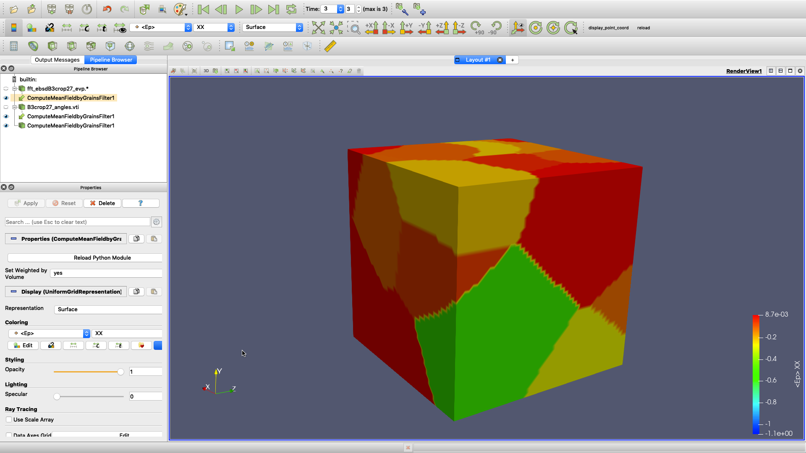

# paraview plugins

This project  contains some examples detailing the creation of a python plugin for the data analysis and visualization software [Paraview](https://www.paraview.org/).

## `MeanByGrainsFilter`

The python code `MeanByGrainsFilter` implement simple paraview python filter to compute mean field for VTK image dataset, used for post-processing FFT solver computation. The plugin use 2 kind of dataset (VTKImage dataset, eg `*.vti`):

- one for input dataset, used to get index number for each phase or grains index (for EVPFFT computation) inside volume dataset ;
- the second is the result dataset, possibly multiple along the time range used (list of multiple output files) ;

## `TresholdShearSystFilter`

The python code `TresholdShearSystFilter` implement simple paraview python filter to compute mean $\gamma$ fields from VTK image dataset, and ouput shear systems index for all grains with mean gamma greater than a given value, used for post-processing FFT solver computation. The plugin use 2 kind of dataset (VTKImage dataset, eg `*.vti`):

- one for input dataset, used to get index number for each phase or grains index (for EVPFFT computation) inside volume dataset ;
- the second is the result dataset, possibly multiple along the time range used (list of multiple output files) ;

## `SelectMacrozoneFilter`

The python code `SelectMacrozoneFilter` create a mask region (a sphere) to only retrieve data from this part of the input image dataset (VTKImage dataset, eg `*.vti`).

## Installation

Just open, then load it from `Tools -> Manage Plugins` paraview menu. That's all. Paraview will search any plugin subdirectory found in `Paraview/plugins` ; You can directly load any plugin from this path.
